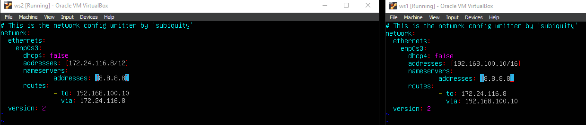
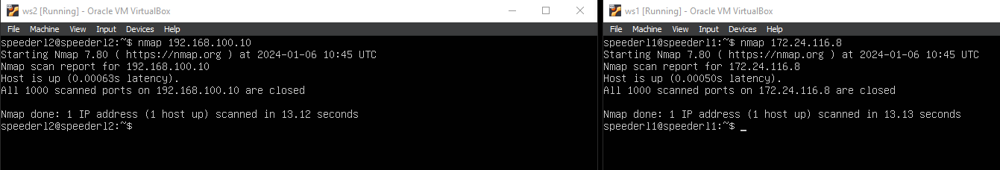
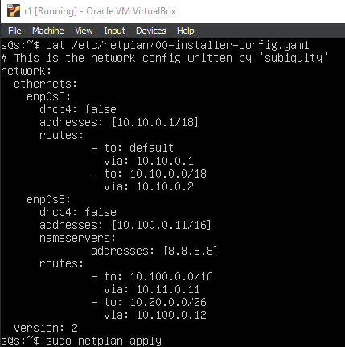
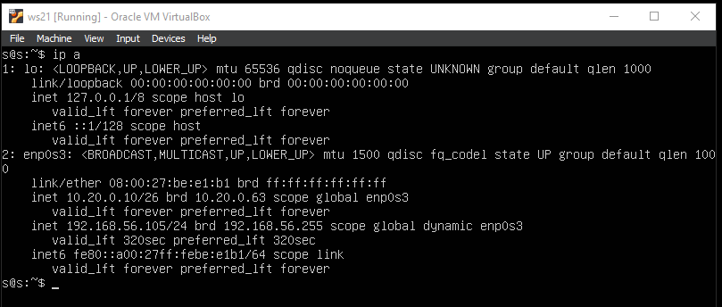
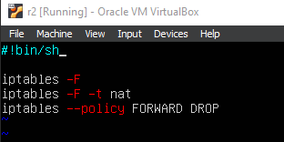

## Part 1. Инструмент ipcalc

#### 1.1. Сети и маски

1) Адрес сети 192.167.38.54

2) 255.255.255.0 
в префиксную: /24

в двоичную запись: 11111111.11111111.11111111.00000000

/15

в обычную: 255.254.0.0

в двоичную: 11111111.11111110.00000000.00000000

11111111.11111111.11111111.11110000

в обычную: 255.255.255.240

в префиксную: /24

3) Минимальный и максимальный хост в сети 12.167.38.4 при масках: /8, 11111111.11111111.00000000.00000000, 255.255.254.0 и /4

/8: Hostmin: 12.0.0.1 Hostmax: 12.255.255.254 

11111111.11111111.00000000.00000000: Hostmin: 12.167.0.1 Hostmax: 12.167.255.254

255.255.254.0: Hostmin: 12.167.38.1 Hostmax: 12.167.39.254

/4: Hostmin: 0.0.0.1 Hostmax: 15.255.255.254

#### 1.2. localhost

194.34.23.100 - нет

127.0.0.2 - да

127.1.0.1 - да

128.0.0.1 - нет

#### 1.3. Диапазоны и сегменты сетей

Определи и запиши в отчёт:

1) IP можно использовать в качестве публичного / только в качестве частных: 

10.0.0.45 - только частные

134.43.0.2 - публичные

192.168.4.2 - только частные

172.20.250.4 - только частные

172.0.2.1 - публичные

192.172.0.1 - публичные

172.68.0.2 - публичные

172.16.255.255 - только частные

10.10.10.10 - только частные

192.169.168.1 - публичные

2) У сети 10.10.0.0/18, IP адреса шлюза возможны:

10.0.0.1 - нет

10.10.0.2 - да

10.10.10.10 - да

10.10.100.1 - нет

10.10.1.255 - да

## Part 2. Статическая маршрутизация между двумя машинами

Вывод ip a:

ws1, как и ws2, имеет сетевой интерфейс lo (выдаваемый самой системой) и enp0s3 (проводной интернет). lo используется для отладки сетевых программ и запуска серверных приложений на локальной машине.

Содержание изменённого файла etc/netplan/00-installer-config.yaml для каждой машины:

#### 2.1. Добавление статического маршрута вручную

Использование ip r add:

ping ws1 c ws2, ws2 c ws1

#### 2.2. Добавь статический маршрут с сохранением

Содержание изменённого файла etc/netplan/00-installer-config.yaml для каждой машины:

ping ws1 c ws2, ws2 c ws1

## Part 3. Утилита iperf3

#### 3.1. Скорость соединения

8 Mbps = 1 MB/s

100 MB/s = 100000 Kbps

1 Gbps = 1000 Mbps

#### 3.2. Утилита iperf3

Ко 2 машине:

К 1 машине:

## Part 4. Сетевой экран

#### 4.1. Утилита iptables

Доступ к портам на машинах:

Содержанием файла /etc/firewall для каждой машины.

Запуск файлов на обеих машинах командами chmod +x /etc/firewall.sh и /etc/firewall.sh:

В iptables важна последовательность действий, и поэтому когда DROP применяется после ACCEPT работает DROP и машина не "пингуется". И наоборот.

#### 4.2. Утилита nmap

Ping:

Nmap:

Сохранены дампы образов виртуальных машин

## Part 5. Статическая маршрутизация сети

#### 5.1. Настройка адресов машин

etc/netplan/00-installer-config.yaml для ws11:

etc/netplan/00-installer-config.yaml для ws21:

etc/netplan/00-installer-config.yaml для ws22:

etc/netplan/00-installer-config.yaml для r1:

etc/netplan/00-installer-config.yaml для r2:

Также пропингуй ws22 с ws21. Аналогично пропингуй r1 с ws11.

ip -4 a для ws11:

ip -4 a для r1:

ip -4 a для ws22:

ip -4 a для r2:

ip -4 a для ws21:

ping ws22 с ws21:

ping r1 с ws11:

#### 5.2. Включение переадресации IP-адресов.

sysctl -w net.ipv4.ip_forward=1 для r1 и r2:

Файл /etc/sysctl.conf для r1 и r2:

#### 5.3. Установка маршрута по-умолчанию

Содержание файла etc/netplan/00-installer-config.yaml и вызов ip r для r2 и r1:

Пинг с ws11 роутера r2 и tcpdump -tn -i на r2:

#### 5.4. Добавление статических маршрутов

Содержание файла etc/netplan/00-installer-config.yaml для каждого роутера и вызов ip r на каждом роутере:

Вызов команд ip r list 10.10.0.0/18 и ip r list 0.0.0.0/0 на ws11:

Для адреса 10.10.0.0/18 был выбран маршрут, отличный от 0.0.0.0/0, так как он является адресом сети и доступен без шлюза.

#### 5.5. Построение списка маршрутизаторов

Вызов и вывод команд tcpdump и traceroute:

Traceroute отправляет узлу ICMP-пакеты с каждым шагом увеличивая значение поля TTL на 1. Первая серия пакетов отправляется с TTL = 1, и маршрутизатор возвращает сообщение "time exceeded in transit" (невозможно доставить данные). Traceroute фиксирует адрес маршрутизатора, затем повторяет отправлку, но с TTL = 2, первый маршрутизатор уменьшает его на 1, а второй возвращает "time exceeded in transit". Так происходит пока не будет достигнут целевой узел.

#### 5.6. Использование протокола ICMP при маршрутизации

tcpdump -n -i eth0 icmp на r1 и ping -c 1 10.30.0.111 на ws11:

Сохранены дампы образов виртуальных машин

## Part 6. Динамическая настройка IP с помощью DHCP

1) Адрес маршрутизатора по-умолчанию, DNS-сервер и адрес внутренней сети для r2:

2) Файл resolv.conf:

Перезагрузка:

ip a на ws21:

ping ws22 c ws21:

Файл etc/netplan/00-installer-config.yaml для ws11:

Адрес маршрутизатора по-умолчанию, DNS-сервер и адрес внутренней сети для r1:

Файл resolv.conf:

Перезагрузка:

ping ws11 c r1:

ip a для ws21

До:

После:

sudo dhclient -r enp0s3 - удаляет текущий адрес интерфейса 

sudo dhclient enp0s3 - задает новый адрес интерфейса

Сохранены дампы образов виртуальных машин

## Part 7. NAT

Файл /etc/apache2/ports.conf на ws22:

Файл /etc/apache2/ports.conf на r1:

Запуск веб-сервера Apache командой service apache2 start на ws22 и r1:

В отчёт помести скрины с вызовом и выводом использованной команды.

Добавлены в фаервол, созданный по аналогии с фаерволом из Части 4, на r2 следующие правила:

1) Удаление правил в таблице filter - iptables -F

2) Удаление правил в таблице "NAT" - iptables -F -t nat

3) Отбрасывать все маршрутизируемые пакеты - iptables --policy FORWARD DROP

Проверка соединения между ws22 и r1 командой ping:

Добавлено в файл ещё одно правило:

4) Разрешить маршрутизацию всех пакетов протокола ICMP

Проверка соединения между ws22 и r1 командой ping

Добавлены в файл ещё два правила:

5) Включить SNAT, а именно маскирование всех локальных ip из локальной сети, находящейся за r2

6) Включить DNAT на 8080 порт машины r2 и добавить к веб-серверу Apache, запущенному на ws22, доступ извне сети

Вызов telnet с r1 на ws22 и с ws22 на ws11:

Сохранены дампы образов виртуальных машин

## Part 8. Знакомство с SSH Tunnels

Запуск на r2 фаервола

Запуск веб-сервера Apache на ws22 только на localhost

Local TCP forwarding с ws21 до ws22 (при помощи команды ssh -L local_port:destination:destination_port ssh_server_ip) и Remote TCP forwarding c ws11 до ws22 (при помощи команды ssh -R remote_port:destination:destination_port ssh_server_ip):

telnet 127.0.0.1 для ws11 и ws21:

Сохранены дампы образов виртуальных машин